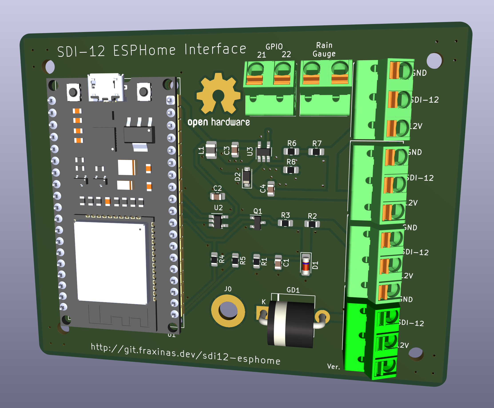

# SDI-12 Interface for ESPHome

(CC) 2023 by Andreas Frisch <github@fraxinas.dev>

## OwO what's this?
**`sdi12-esphome` is an ESP32-based interface for connecting professional meteorologic sensors with ESPHome and Home Assistant**

## Hardware Features
* Based on a NodeMCU ESP32 Module
* 4x SDI-12 inputs via push-in terminals
* Step-up conversion for the 12V SDI-12 sensor power
* Transient surge protection for the SDI-12 data bus
* PCB fits into a BOPLA 100x100mm IP65 case

## Software Features
* Home Assistant intergration using ESPHome.io

## Custom Components
### SDI-12 Bus
* is a wrapper around the https://github.com/EnviroDIY/Arduino-SDI-12 library, with the https://github.com/RAKWireless/RAK13010-SDI12/ modifications to split input, output and enable into separate GPIOs
* allows configuring an SDI-12 Bus component that sensors can be attached to
* configure RX, TX & OE pins through configuration YAML
* provide address scan method

### CS215
* Campbell Scientific CS215 Temperature and Relative Humidity Probe
* https://s.campbellsci.com/documents/ca/manuals/cs215_man.pdf

### DS2
* Decagon Devices DS-2 Sonic Anemometer
* https://library.metergroup.com/Manuals/14586_DS2_Web.pdf
* Sensors for
  * wind speed
  * wind direction
  * wind temperature

### TODOs
- [ ] SDI-12 Bus component (feature complete & tests)
- [ ] Themometer/Hygrometer (feature complete & tests)
- [ ] Anemometer (feature complete & tests)
- [ ] Rain Gauge (start)
- [ ] Generic Sensor (start)
- [ ] Documentation / Photos

## Project Diary
| Date       | Version | Milestone                                        |
| :--------- | :------ | :----------------------------------------------- |
| 2023-10-22 |         | Started Project on the breadboard                |
| 2023-11-06 |         | First successful sensor readout in EPSHome       |
| 2023-11-13 |  v0.1   | Order prototype design at JLCPCB                 |

## Resources
* https://www.sdi-12.org/current_specification/SDI-12_version-1_4-Jan-10-2019.pdf
* https://ww1.microchip.com/downloads/en/DeviceDoc/20005315B.pdf
